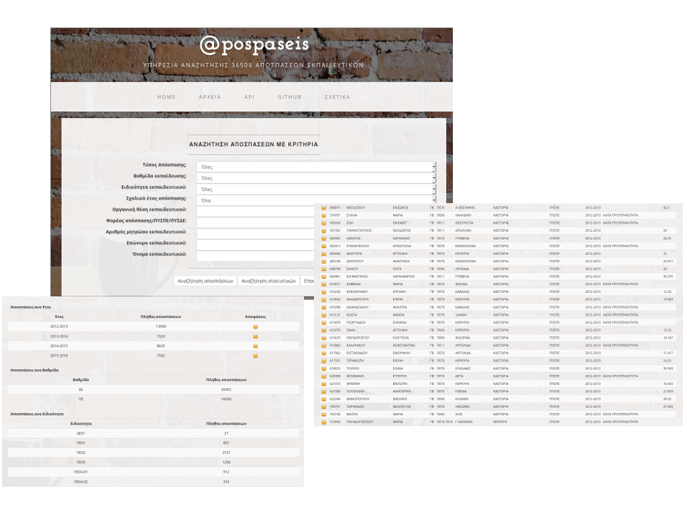

# @pospaseis

<h2>Υπηρεσία αναζήτησης αποσπάσεων εκπαιδευτικών</h2>

http://apospaseis.ellak.gr/

<h2>Χρηστικότητα</h2>

Ένα μεγάλο ποσοστό εκπαιδευτικών εμπλέκεται κάθε χρόνο στη διαδικασία αποσπάσεων από περιοχή σε περιοχή και σε φορείς του υπουργείου παιδείας. Οι αποφάσεις των αποσπάσεων εκδίδονται κατά τη διάρκεια του πρώτου εξαμήνου του κάθε σχολικού έτους,  από διαφορετικά τμήματα του υπουργείου, σε πολλά ηλεκτρονικά αρχεία που δεν τηρούν  συγκεκριμένες προδιαγραφές (είναι εντελώς διαφορετικά μεταξύ τους). Συνεπώς, σημαντική πληροφορία αναφορικά με τις αποσπάσεις των εκπαιδευτικών χάνεται στην πληθώρα των αρχείων που εκδίδει κάθε χρόνο το υπουργείο. 
Το έργο έχει ως στόχο την ανάπτυξη του @pospaseis που είναι μια υπηρεσία που διευκολύνει τους εκπαιδευτικούς στο να ανακαλύψουν αυτήν την κρυμμένη πληροφορία προσφέροντας τους μια μηχανή αναζήτησης πολλαπλών κριτηρίων που επιτρέπει την εύκολη πλοήγηση στην πληθώρα των αποφάσεων αποσπάσεων που εκδίδει το υπουργείο. Με τον τρόπο αυτό, ο χρήστης της υπηρεσίας μπορεί να "ανακαλύψει", για παράδειγμα, πόσοι, ποιοι και τι ειδικότητας εκπαιδευτικοί αποσπάστηκαν σε συγκεκριμένο φορέα. Εκτός από τη διεπαφή ιστού που επιτρέπει το χρήστη να αναζητήσει πληροφορίες σχετικά με τις αποσπάσεις, το @pospaseis προσφέρει μια διεπαφή προγραμματισμού εφαρμογών (API) που επιτρέπει την αναζήτηση και την ανάκτηση της πληροφορίας σε μορφή JSON μέσω αιτημάτων http. Έτσι, To @pospaseis δίνει τη δυνατότητα σε οποιονδήποτε προγραμματιστή να πραγματοποιήσει αναζητήσεις μέσα από την εφαρμογή του ή το site του. 

<h2>Παραδοτέα</h2>

<ul type=circle>
<li><b>Π1 (deliverable 1)</b> Εκπονήθηκε μελέτη σχετικά με την ανάλυση και τη σχεδίαση της υπηρεσίας. Επίσης, ορίστηκαν οι τεχνολογίες που θα χρησιμοποιηθούν κατά την ανάπτυξη της υπηρεσίας. Η σχετική έκθεση είναι διαθέσιμη στο https://github.com/ellak-monades-aristeias/apospaseis/tree/master/deliverable1
</li>
<li><b>Π2 (deliverable 2)</b> Ανακτήθηκαν από το διαδίκτυο όλα τα αρχεία αποφάσεων απόσπασης που εκδόθηκαν από το ΥΠΠΑΙΘ κατά τη διάρκεια των τελευταίων τεσσάρων σχολικών ετών (2012-13, 2013-14, 2014-15 και 2015-16). Τα αρχεία αυτά προ-επεξεργάστηκαν (κρατήθηκε η χρήσιμη πληροφορία) και τα δεδομένα τους αποθηκεύτηκαν σε ένα ενιαίο αρχείο. Την ίδια περίοδο αναπτύχθηκε η Βάση Δεδομένων (ΒΔ) της υπηρεσίας, η οποία αποτελείται από τρεις πίνακες. Τα δεδομένα του ενιαίου αρχείου καταχωρήθηκαν στη ΒΔ μέσω μιας μικροεφαρμογής που αναπτύχθηκε για τον σκοπό αυτό (https://github.com/ellak-monades-aristeias/apospaseis/tree/master/deliverable3/uploader). Το Π2 περιλαμβάνει το ενιαίο αρχείο σε μορφή xls και αντίγραφο της ΒΔ. Τα δύο αρχεία είναι διαθέσιμα στο https://github.com/ellak-monades-aristeias/apospaseis/tree/master/deliverable2
</li>
<li><b>Π3 (deliverable 3)</b> Αναπτύχθηκε το website της υπηρεσίας. Ο κώδικας είναι διαθέσιμος στο https://github.com/ellak-monades-aristeias/apospaseis/tree/master/deliverable3. Το website δίνει τη δυνατότητα αναζήτησης αποσπάσεων και στατιστικών σχετικά με τις αποσπάσεις. Επίσης δίνει τη δυνατότητα πλοήγησης στα πρωτότυπα αρχεία αποφάσεων απόσπασης.  Το παραδοτέο αυτό περιλαμβάνει και τη μικροεφαρμογή που αναφέρθηκε παραπάνω.
</li>
<li><b>Π4 (deliverable 4)</b> Αναπτύχθηκε το API μέσω του οποίου τα αποτελέσματα των αναζητήσεων ανακτώνται σε μορφή JSON κατόπιν αιτήματος http. Το API και οδηγίες σχετικά με τη χρήση του ενσωματώθηκε στο website. Ο συνολικός κώδικας του @pospaseis είναι διαθέσιμος στο https://github.com/ellak-monades-aristeias/apospaseis/tree/master/deliverable4/site_with_api
</li>
<li><b>Π5 (deliverable 5)</b> Συντάχθηκε μια εργασία που παρουσιάζει την υπηρεσία και τα στάδια ανάπτυξης της. Η εργασία πρόκειται να υποβληθεί προς κρίση σε συνέδριο. Η εργασία είναι διαθέσιμη στο https://github.com/ellak-monades-aristeias/apospaseis/tree/master/deliverable5 
</li>
</ul>

Δείτε την περιγραφή του έργου στο wiki

Δείτε το χρονοδιάγραμμα του έργου στο wiki

